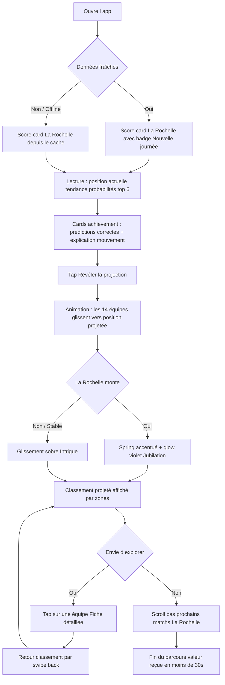
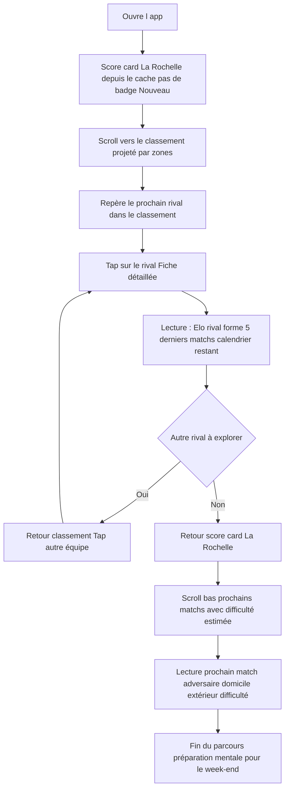
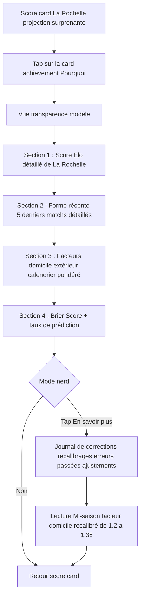
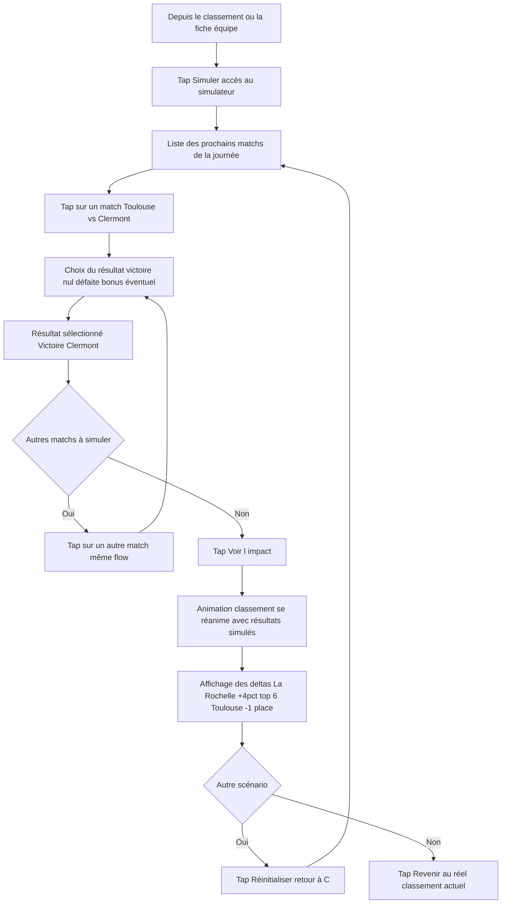

# UX Design Specification Whistle

**Auteur :** higgin
**Date :** 2026-03-28

---

## Executive Summary

### Vision Produit

Whistle est une PWA personnelle qui transforme des projections statistiques en expérience visuelle quasi-sportive. Le classement projeté du TOP 14 existe en données brutes — Whistle le rend vivant via une animation où les 14 équipes glissent vers leur position prédite de fin de saison. L'utilisateur ouvre l'app le lundi matin et voit instantanément l'impact du week-end sur la course au titre, à la qualification européenne ou au maintien.

### Utilisateurs Cibles

Utilisateur unique : higgin, supporter de La Rochelle, développeur. Profil tech-savvy mais l'expérience recherchée est émotionnelle et visuelle, pas analytique. Utilisation principale sur Android en mobilité (portrait, touch). Deux parcours dominants : le lundi matin post-journée (découverte des changements) et en milieu de semaine (consultation en cache, exploration).

### Défis UX Clés

- **Lisibilité de l'animation** : 14 équipes en mouvement simultané doivent rester lisibles — guider l'oeil vers l'équipe favorite et les mouvements spectaculaires sans créer de confusion visuelle
- **Communication de la confiance** : le modèle prédictif a des incertitudes variables (forte en début de saison, décroissante). L'interface doit rendre cette confiance intuitive sans briser le plaisir de l'expérience
- **Contraintes mobile strict** : écrans 360-430px, portrait uniquement, zones tap 48px, animations 60fps — chaque élément doit être conçu pour ces contraintes dès le départ

### Opportunités UX

- **L'émotion du mouvement** : la transition animée classement actuel → classement projeté peut créer un vrai moment de plaisir quasi-sportif, un micro-suspense à chaque ouverture de l'app
- **Storytelling prédictif** : le modèle explique ses projections en langage naturel ("La Rochelle monte parce que..."), transformant des statistiques en récit de supporter
- **Simplicité radicale** : un seul utilisateur, une équipe favorite, zéro configuration — chaque pixel peut être optimisé pour un parcours unique et précis
- **Inspiration jeu vidéo** : une prédiction est fondamentalement un jeu — on parie mentalement, on attend le dénouement, on a raison ou tort. Cette boucle d'engagement (anticipation → résultat → récompense/surprise) est la même que dans les jeux vidéo. L'UX peut s'en inspirer : feedback visuel satisfaisant quand le modèle a vu juste, animations de type "reveal" pour les nouvelles projections, progression visible au fil de la saison comme un score qui monte. Le classement animé n'est pas qu'une visualisation de données — c'est un mini-jeu hebdomadaire

## Core User Experience

### Expérience Définissante

L'expérience coeur de Whistle est un **reveal en deux temps** :

1. **L'app s'ouvre instantanément** sur la fiche La Rochelle avec le classement actuel — ce qui s'est passé
2. **L'utilisateur déclenche la projection** — les équipes glissent vers leur position prédite. C'est le moment de vérité, le "résultat du match" entre le modèle et la réalité

Ce séquençage crée un micro-suspense inspiré du jeu vidéo : d'abord l'état du monde, puis la révélation de ce que ça implique pour la suite. L'utilisateur contrôle le moment du reveal.

### Boucle d'Engagement

La boucle de jeu hebdomadaire suit le cycle classique du game design :

- **Anticipation** (semaine) : le modèle a fait ses prédictions, les matchs approchent
- **Action** (lundi matin) : ouverture de l'app, découverte du classement réel
- **Résultat** (tap "Projeter") : l'animation révèle les nouvelles projections
- **Récompense** : savoir si le modèle a eu raison — feedback visuel clair sur les prédictions correctes vs les surprises

La récompense n'est pas un score ou un badge : c'est la **satisfaction intellectuelle** de voir le modèle confirmé, ou la **surprise** quand il s'est trompé. Les deux sont intéressantes.

### Rétention Mi-Semaine

Entre deux journées, l'app reste pertinente grâce à :
- **Exploration du prochain rival** : stats, forme, Elo, difficulté estimée du match à venir
- **Simulateur "Et si..."** (post-MVP) : jouer avec les résultats possibles et voir l'impact sur le classement

### Plateforme

- PWA Android-only, portrait, touch-first
- Écrans 360-430px, zones tap 48px minimum
- Offline-first : cache agressif, données toujours disponibles
- Chargement < 2s sur 4G, < 1s depuis le cache

### Interactions Sans Friction

- **L'ouverture de l'app** est LE geste magique — il doit être instantané et montrer immédiatement la fiche La Rochelle à jour, sans écran de chargement, sans splash screen qui traîne, sans action requise
- **Le tap "Projeter"** doit être évident et accessible sans scroll
- **La navigation entre équipes** doit être fluide — tap sur une équipe dans le classement → sa fiche

### Moments Critiques de Succès

- **Premier lundi** : l'utilisateur ouvre l'app, voit le classement, projette, et comprend instantanément la valeur — "c'est exactement ça que je voulais"
- **Le reveal** : l'animation de projection doit provoquer une réaction émotionnelle — plaisir si La Rochelle monte, tension si elle descend
- **La prédiction juste** : quand le modèle avait raison, le feedback visuel doit être satisfaisant — comme un "bien joué" silencieux
- **La surprise** : quand le modèle s'est trompé, ça doit être intéressant, pas frustrant — "tiens, qu'est-ce qui s'est passé ?"

### Principes d'Expérience

1. **Reveal, pas display** — on ne montre pas des données, on dévoile un résultat. Chaque ouverture est un mini-événement
2. **Zéro friction à l'entrée** — l'app ouverte = valeur immédiate. Pas de login, pas de loading, pas de choix à faire
3. **Le modèle est un personnage** — il a raison, il se trompe, il s'améliore. L'utilisateur développe une relation avec ses prédictions
4. **Mobile-native, pas mobile-adapté** — conçu pour le pouce, le portrait, le metro. Pas un site web rétréci

## Desired Emotional Response

### Objectifs Émotionnels Primaires

- **Excitation à l'ouverture** : chaque lundi matin, ouvrir Whistle doit provoquer un rush d'adrénaline sportive — "qu'est-ce qui a changé ?!". L'app doit donner l'impression d'arriver au stade avant le coup d'envoi
- **Jubilation au reveal** : quand La Rochelle monte, c'est un petit rush de victoire. L'animation doit amplifier ce sentiment — pas juste informer, mais faire ressentir le mouvement comme un but marqué
- **Intrigue face à l'erreur** : quand le modèle se trompe, la réaction cible est "tiens, pourquoi ?" — pas de frustration, mais une curiosité qui donne envie de comprendre. L'erreur du modèle est un rebondissement narratif, pas un bug

### Émotion Interdite

**La complexité ne doit JAMAIS transparaître.** Le modèle Elo, les calculs de probabilité, la décroissance temporelle — tout ça existe sous le capot mais l'utilisateur ne doit jamais se sentir face à un outil compliqué. Si l'interface provoque un moment de "c'est quoi ça ?", c'est un échec de design.

### Cartographie du Parcours Émotionnel

| Moment | Émotion cible | Intensité |
|---|---|---|
| Ouverture de l'app | Excitation, impatience | Haute |
| Découverte du classement actuel | Curiosité, anticipation | Moyenne |
| Tap "Projeter" | Suspense | Pic |
| Animation en cours | Tension ludique | Pic |
| Résultat : La Rochelle monte | Jubilation | Pic |
| Résultat : La Rochelle descend | Tension narrative, envie de comprendre | Moyenne-haute |
| Le modèle avait raison | Satisfaction complice | Moyenne |
| Le modèle s'est trompé | Intrigue, amusement | Moyenne |
| Exploration mi-semaine | Curiosité calme | Basse-moyenne |
| App offline / en cache | Confort, fiabilité | Basse |

### Micro-Émotions

- **Confiance > Confusion** : chaque élément d'interface doit être immédiatement compréhensible. Zéro moment d'hésitation
- **Excitation > Anxiété** : le suspense du reveal doit rester ludique, jamais stressant. C'est un jeu, pas un enjeu réel
- **Accomplissement > Frustration** : même quand les résultats sont mauvais pour La Rochelle, l'expérience reste positive — c'est le plaisir du jeu qui domine
- **Délice > Simple satisfaction** : viser le "oh !" plutôt que le "ok". L'animation, le feedback visuel, les transitions doivent surprendre agréablement

### Implications Design

- **Excitation à l'ouverture** → couleurs vives, données fraîches immédiatement visibles, indicateur de "nouveau depuis ta dernière visite", pas d'écran d'attente
- **Jubilation au reveal** → animation fluide et dramatique, mise en valeur des mouvements importants, feedback visuel amplifié pour l'équipe favorite
- **Intrigue face à l'erreur** → le modèle "raconte" ses surprises, ton léger et humble, invitation à explorer plutôt qu'excuse
- **Anti-complexité** → mode simple par défaut, vocabulaire accessible, détails techniques cachés derrière un geste explicite (tap "en savoir plus"), jamais de jargon statistique en surface

### Principes de Design Émotionnel

1. **Sportif avant analytique** — l'émotion du stade, pas celle du tableur. Les chiffres servent le récit, ils ne sont pas le récit
2. **Le suspense est un outil** — le reveal en deux temps existe pour créer de l'excitation. Ne jamais court-circuiter le suspense par commodité
3. **L'erreur est un épisode** — quand le modèle se trompe, c'est un rebondissement intéressant, pas un dysfonctionnement. Le design doit traiter les surprises comme du contenu, pas comme des exceptions
4. **La simplicité est émotionnelle** — si l'utilisateur doit réfléchir à l'interface, l'émotion sportive est brisée. La complexité technique doit être invisible

## UX Pattern Analysis & Inspiration

### Analyse des Produits Inspirants

#### Pokémon TCG Pocket
- **Ce qu'ils font bien** : le reveal d'ouverture de booster est un chef-d'oeuvre de suspense — on voit les cartes une par une, l'animation ralentit sur les rares, le feedback visuel explose sur les ultra-rares. C'est exactement la mécanique anticipation → reveal → récompense/surprise
- **Pattern clé** : la qualité du feedback visuel est proportionnelle à l'importance de l'événement. Un résultat banal = transition sobre. Un résultat exceptionnel = animation amplifiée
- **Pertinence Whistle** : le reveal de projection peut s'inspirer directement de cette graduation — un mouvement de +1 place = glissement fluide, un bond de +3 places = animation accentuée, effets visuels renforcés

#### Netflix
- **Ce qu'ils font bien** : zéro friction à l'entrée. L'app s'ouvre, le contenu est là, personnalisé, immédiat. Pas de question, pas de choix à faire avant de voir de la valeur. L'autoplay lance le contenu sans action supplémentaire
- **Pattern clé** : la personnalisation silencieuse — l'app sait ce que tu veux voir sans te demander. L'interface s'adapte à toi, pas l'inverse
- **Pertinence Whistle** : l'ouverture sur la fiche La Rochelle sans aucune action requise. L'app sait qui tu es, ce qui t'intéresse, et te le montre instantanément

#### Waze
- **Ce qu'ils font bien** : données temps réel rendues visuelles et actionnables. La carte est vivante — les incidents apparaissent, les temps changent, tout bouge. L'information complexe (trafic, accidents, police) est résumée en un coup d'oeil
- **Pattern clé** : la visualisation dynamique de données temps réel avec des codes couleur immédiatement lisibles (vert/orange/rouge). L'information complexe devient intuitive par la couleur et le mouvement
- **Pertinence Whistle** : les zones de classement colorées (bleu Europe, vert top 6, gris ventre mou, rouge maintien) suivent exactement ce principe. Le classement est une "carte" du championnat

#### Babbel
- **Ce qu'ils font bien** : micro-sessions qui créent une habitude quotidienne. Progression visible, feedback immédiat (correct/incorrect), sentiment d'avancement constant. La boucle est courte et satisfaisante
- **Pattern clé** : la boucle d'engagement courte avec feedback immédiat et progression visible dans le temps. Chaque session est autonome mais s'inscrit dans une trajectoire
- **Pertinence Whistle** : chaque lundi est une "leçon" — courte, autonome, avec un feedback clair (le modèle a eu raison ou tort). La progression du Brier Score au fil de la saison = la streak Babbel

### Patterns UX Transférables

**Patterns de Reveal (← Pokémon TCG)**
- Graduation du feedback : intensité visuelle proportionnelle à l'importance du mouvement
- Contrôle du timing par l'utilisateur : c'est toi qui déclenches le reveal, pas l'app
- Suspense construit : montrer d'abord le contexte (classement actuel), puis le résultat (projection)

**Patterns de Zéro-Friction (← Netflix)**
- Ouverture = valeur immédiate, personnalisée, sans action requise
- Pas de splash screen inutile, pas d'onboarding répétitif
- Le contenu frais est mis en avant visuellement ("Nouveau depuis ta dernière visite")

**Patterns de Data Vivante (← Waze)**
- Codes couleur universels pour encoder l'information (zones de classement)
- Le mouvement comme porteur d'information (pas juste décoratif)
- Données complexes résumées visuellement, détails disponibles au tap

**Patterns de Boucle d'Engagement (← Babbel)**
- Micro-session hebdomadaire autonome mais inscrite dans une progression de saison
- Feedback binaire satisfaisant : le modèle a eu raison / s'est trompé
- Progression visible dans le temps (évolution du Brier Score, historique des prédictions)

### Anti-Patterns à Éviter

- **Le dashboard surchargé** (apps sportives classiques) : trop de stats, trop de tableaux, trop de chiffres. Whistle n'est pas un outil d'analyse — c'est une expérience de reveal
- **Le loading spinner** : Netflix ne montre jamais un écran vide. Whistle doit toujours avoir des données en cache à montrer instantanément
- **Le tutoriel obligatoire** : Babbel le fait bien pour l'apprentissage, mais Whistle est trop simple pour nécessiter un onboarding. L'interface doit être auto-explicative
- **La notification agressive** : Waze notifie en temps réel parce que c'est critique (route). Whistle est hebdomadaire — pas de push, pas d'urgence artificielle
- **L'animation gratuite** : Pokémon TCG calibre ses animations. Un booster commun ≠ un booster rare. Whistle ne doit pas sur-animer un mouvement de 0 places

### Stratégie d'Inspiration Design

**Adopter directement :**
- Le reveal gradué de Pokémon TCG → feedback visuel proportionnel au mouvement
- Le zéro-friction Netflix → ouverture instantanée sur contenu personnalisé
- Les codes couleur Waze → zones de classement immédiatement lisibles

**Adapter :**
- La boucle Babbel → rythme hebdomadaire au lieu de quotidien, progression sur une saison au lieu d'un cursus
- La data vivante Waze → classement animé au lieu de carte routière, même principe de mouvement porteur de sens

**Éviter :**
- Le mode "analytics dashboard" des apps sportives → on reste dans l'émotion, pas dans l'analyse
- La surcharge informationnelle → chaque écran a UN message principal
- L'animation décorative → tout mouvement doit porter du sens

## Design System Foundation

### Choix du Design System

**Approche : Custom minimaliste + Open Props + Motion One**

Stack CSS/animation en trois couches complémentaires :

1. **CSS custom** : structure, layout, composants — contrôle total, zéro dépendance superflue
2. **Open Props (~2Ko)** : design tokens CSS natifs — couleurs, espacements, easings prédéfinis, typographie. Fournit une base cohérente sans imposer de composants
3. **Motion One (~4Ko)** : micro-librairie d'animation physique — spring animations, stagger avancé, timelines séquencées. Le "moteur de jeu" de Whistle

Poids total du design system : **~6Ko gzippé** — largement dans le budget de 200Ko.

### Justification du Choix

- **Performance** : aucun framework UI lourd, chaque Ko est justifié. Le rendu reste GPU-composité à 60fps
- **Animations "jeu vidéo"** : Motion One apporte les spring physics (rebonds, overshoot, inertie) impossibles à reproduire proprement en CSS pur. C'est la différence entre "ça glisse" et "ça vit"
- **Cohérence sans rigidité** : Open Props donne des tokens harmonieux (easings, durées, couleurs) sans imposer une esthétique. Le rendu final est unique à Whistle
- **Pas de conflit** : contrairement à un framework UI (MUI, Chakra), aucun composant pré-stylé ne viendra interférer avec les animations custom du classement
- **Maintenabilité solo** : un développeur unique maîtrise tout le stack — pas de couche d'abstraction à debugger

### Approche d'Implémentation

**Couche 1 — Design Tokens (Open Props)**
- Palette de couleurs : tokens pour les zones de classement (Europe, top 6, ventre mou, maintien) + couleur d'accentuation équipe favorite
- Espacements : grille cohérente optimisée pour 360-430px
- Typographie : échelle lisible mobile, hiérarchie claire
- Easings : `--ease-elastic`, `--ease-squish` pour les animations de reveal

**Couche 2 — Composants CSS Custom**
- Fiche équipe (carte héro La Rochelle)
- Ligne de classement (position, logo, nom, indicateurs)
- Zones colorées (bandes de fond Europe/top 6/ventre mou/maintien)
- Bouton "Projeter" (CTA principal, toujours visible)
- Indicateurs de confiance et tendance

**Couche 3 — Moteur d'Animation (Motion One)**
- **Animation de projection** : spring physics pour le glissement des équipes, stagger décalé (pas toutes en même temps), overshoot proportionnel au mouvement
- **Reveal gradué** (inspiration Pokémon TCG) : mouvement de +1 place = glissement fluide sobre ; bond de +3 places = spring plus prononcé, léger glow sur l'équipe
- **Micro-animations** : pulsation douce sur l'équipe favorite, transitions entre vues, feedback au tap
- **Performance** : toutes les animations sur `transform` et `opacity` uniquement → compositing GPU, 60fps garanti

### Stratégie de Personnalisation

**Identité visuelle Whistle :**
- Ni corporate (Material Design) ni générique — sportif, ludique, nocturne
- Fond sombre pour faire ressortir les couleurs des zones et le mouvement
- Couleurs vives et saturées pour les zones de classement — le classement est un terrain de jeu, pas un rapport
- Typographie bold et lisible — titres qui claquent, chiffres qui sautent aux yeux
- Animations avec du caractère : spring physics, pas des linear transitions plates

**Ce qui ne sera PAS custom :**
- Accessibilité : contrastes WCAG AA respectés via les tokens Open Props
- Grille et espacements : tokens standard, pas de valeurs magiques
- Breakpoints : inutiles (mobile-only, 360-430px)

## Expérience Définissante Détaillée

### L'Interaction Signature

**"Appuie → regarde ton équipe glisser vers son futur."**

Whistle remplace un processus mental flou (parcourir rugbyrama, estimer des calendriers, deviner des formes) par un geste unique qui donne une réponse visuelle instantanée. Le modèle mathématique fait le travail que le cerveau du supporter essaie de faire — mais en mieux, plus vite, et avec un résultat qu'on peut voir bouger.

### Modèle Mental de l'Utilisateur

**Aujourd'hui (sans Whistle) :**
- Aller sur rugbyrama, regarder le classement
- Parcourir les calendriers restants des équipes rivales
- Essayer d'estimer mentalement la forme de chaque équipe
- Croiser tout ça dans sa tête pour deviner si La Rochelle peut se qualifier
- Résultat : une sensation floue, abstraite, peu fiable — "je crois que ça peut le faire"

**Avec Whistle :**
- Ouvrir l'app → voir la réponse
- Le modèle a déjà fait le calcul que le cerveau essayait de faire
- Le résultat n'est pas un chiffre dans un tableau — c'est un mouvement visible
- Résultat : une réponse claire, visuelle, satisfaisante — "le modèle dit 62% top 6, et je vois La Rochelle glisser vers le haut"

**Le shift clé :** passer de "je devine en parcourant des pages" à "je vois la réponse bouger devant moi". Whistle transforme une intuition de supporter en projection quantifiée et animée.

### Critères de Succès de l'Interaction Coeur

- **< 3 secondes** entre l'ouverture de l'app et la compréhension de la situation de La Rochelle
- **1 tap** pour déclencher la projection — pas de menu, pas de filtre, pas de configuration
- **Lisibilité immédiate** : sans lire un seul chiffre, le mouvement et les couleurs racontent l'essentiel
- **Émotion avant information** : l'utilisateur *ressent* le résultat (La Rochelle monte !) avant de *lire* les détails (62% top 6)
- **Le "ah !" test** : si l'animation de projection ne provoque pas une micro-réaction (sourire, grimace, "oh"), c'est raté

### Patterns UX : Familier Réinventé

L'expérience combine des patterns établis de façon innovante :

**Patterns familiers :**
- Le classement sportif vertical — tout supporter connaît ce format, zéro apprentissage
- Les zones colorées — calque mental déjà présent chez le fan de rugby (Europe, top 6, maintien)
- Le tap comme déclencheur — geste universel mobile

**Innovation Whistle :**
- Le classement qui **bouge** — personne ne fait ça. Les classements sont statiques partout. Le mouvement est le différenciateur
- Le reveal en deux temps — d'abord le présent (familier), puis le futur (surprise). Ce séquençage n'existe pas dans les apps sportives
- Le feedback gradué inspiré jeu vidéo — l'intensité de l'animation encode l'importance du changement. Pas besoin de lire, il suffit de regarder

**Métaphore centrale :** le classement n'est pas un tableau — c'est une **course en cours**. Les équipes ne sont pas à des positions fixes, elles sont en mouvement. Whistle rend ce mouvement visible.

### Mécaniques de l'Expérience

**1. Initiation — L'ouverture**
- L'app s'ouvre sur la fiche La Rochelle : position actuelle, tendance, zone
- Indicateur visuel "Nouvelle journée" si des données fraîches sont disponibles depuis la dernière visite
- Le bouton "Projeter" est visible sans scroll, proéminent, invitant — il appelle au tap

**2. Interaction — Le reveal**
- Tap sur "Projeter"
- Transition : le classement actuel se transforme en classement projeté
- Les 14 équipes glissent simultanément avec un stagger (décalage temporel) — pas toutes en même temps
- Spring physics : les équipes qui bougent peu = glissement sobre ; les équipes qui bondissent = overshoot + glow
- La Rochelle est visuellement accentuée (couleur, taille, ou luminosité) pour que l'oeil la suive naturellement
- Durée totale de l'animation : ~2-3 secondes — assez long pour être satisfaisant, assez court pour ne pas ennuyer

**3. Feedback — La lecture**
- Après l'animation, chaque équipe affiche sa position projetée avec un indicateur de mouvement (↑2, ↓1, =)
- Les zones colorées sont visibles en arrière-plan — on voit immédiatement dans quelle zone La Rochelle atterrit
- Indicateur de confiance subtil par équipe (opacité, épaisseur de bordure, ou icône)
- Si le modèle avait prédit correctement la semaine précédente : micro-feedback satisfaisant (à définir visuellement)

**4. Complétion — L'exploration**
- Tap sur n'importe quelle équipe → fiche détaillée (Elo, forme, calendrier, probabilités)
- Retour au classement par swipe ou bouton back
- L'animation peut être rejouée (tap "Projeter" à nouveau = reset + replay)
- Scroll vers le bas : prochains matchs de La Rochelle avec difficulté estimée

## Visual Design Foundation

### Système de Couleurs

**Couleur identitaire : Violet**
Le violet est la signature de Whistle — inhabituel dans l'univers sportif (dominé par le bleu/rouge/vert), il marque immédiatement une différence. Le violet porte aussi le côté "prédiction", mystère, anticipation — parfaitement aligné avec l'ADN de l'app.

**Palette des zones de classement :**

| Zone | Couleur | Rôle | Usage |
|---|---|---|---|
| Europe (top 2) | Violet | Zone d'élite + identité Whistle | Bande de fond, accents |
| Top 6 (play-offs) | Vert | Zone qualificative | Bande de fond |
| Ventre mou (7-12) | Gris | Zone neutre | Bande de fond atténuée |
| Maintien (13-14) | Rouge | Zone de danger | Bande de fond |

**Palette fonctionnelle :**

| Token | Rôle | Description |
|---|---|---|
| `--color-primary` | Violet Whistle | Couleur identitaire, CTA, accents, équipe favorite mise en avant |
| `--color-surface` | Blanc cassé / crème | Fond principal — clair, lumineux, aéré |
| `--color-surface-elevated` | Blanc pur | Cartes et éléments élevés (fiche équipe, lignes de classement) |
| `--color-text-primary` | Gris très foncé | Texte principal — pas du noir pur (moins agressif) |
| `--color-text-secondary` | Gris moyen | Labels, métadonnées, texte secondaire |
| `--color-success` | Vert | Tendance hausse, prédiction correcte |
| `--color-danger` | Rouge | Tendance baisse, zone maintien |
| `--color-confidence-high` | Vert | Confiance élevée du modèle |
| `--color-confidence-mid` | Orange | Confiance moyenne |
| `--color-confidence-low` | Rouge pâle | Confiance faible (début de saison) |

**Principes couleur :**
- Fond clair pour la lisibilité et l'accessibilité — les couleurs des zones ressortent mieux sur fond clair que sur fond sombre
- Le violet est réservé aux éléments importants : zone Europe, bouton "Projeter", mise en valeur de La Rochelle, accents UI. Pas de violet partout — il doit rester spécial
- Les zones colorées sont en arrière-plan avec opacité réduite — elles teintent sans dominer, les équipes restent lisibles par-dessus
- Mode clair uniquement (pas de dark mode pour le MVP — simplicité)

### Système Typographique

**Police principale : Nunito (ou Quicksand)**

Typographie ronde, fun et accessible — alignée avec le positionnement ludique de Whistle. Les formes arrondies adoucissent les données chiffrées et renforcent le côté "jeu" plutôt que "outil analytique".

**Échelle typographique :**

| Token | Taille | Poids | Usage |
|---|---|---|---|
| `--text-hero` | 32px | 800 (ExtraBold) | Position projetée de La Rochelle, chiffre principal |
| `--text-h1` | 24px | 700 (Bold) | Titres de section ("Classement projeté") |
| `--text-h2` | 20px | 700 (Bold) | Sous-titres (nom d'équipe dans la fiche) |
| `--text-body` | 16px | 400 (Regular) | Texte courant, explications du modèle |
| `--text-label` | 14px | 600 (SemiBold) | Labels, métadonnées (Elo, confiance) |
| `--text-caption` | 12px | 400 (Regular) | Texte tertiaire, timestamps |

**Principes typographiques :**
- Les chiffres clés (position, probabilité, tendance) sont toujours en `--text-hero` ou `--text-h1` — ils sautent aux yeux avant le texte
- Les noms d'équipe sont toujours en Bold — lisibles dans l'animation même en mouvement
- Le texte explicatif du modèle est en `--text-body` — lisible mais ne vole pas la vedette aux chiffres
- Chiffres tabulaires (tabular-nums) pour l'alignement dans le classement

### Fondation Espacement & Layout

**Unité de base : 8px**

Grille d'espacement en multiples de 8px — standard mobile, compatible avec les tailles de tap de 48px (6 × 8px).

| Token | Valeur | Usage |
|---|---|---|
| `--space-xs` | 4px | Espacement interne serré (entre icône et label) |
| `--space-sm` | 8px | Espacement interne composant |
| `--space-md` | 16px | Espacement entre éléments d'un groupe |
| `--space-lg` | 24px | Espacement entre sections |
| `--space-xl` | 32px | Marges de page, séparation majeure |
| `--space-2xl` | 48px | Hauteur minimum d'une ligne de classement (zone tap) |

**Layout global :**
- Padding horizontal de page : 16px de chaque côté → zone de contenu de 328-398px
- Approche **aérée** : les 14 lignes de classement ne tiennent pas forcément en un écran — le confort de lecture prime sur la densité
- Chaque ligne de classement : 48px minimum de hauteur, avec respiration verticale de 8px entre les lignes
- La fiche La Rochelle en haut occupe ~40% de l'écran au premier affichage — c'est le héro, elle doit dominer
- Le bouton "Projeter" est sticky en bas de l'écran ou juste sous la fiche héro — toujours accessible

**Principes de layout :**
- Scroll vertical naturel — pas de pagination, pas de tabs pour le classement
- Hiérarchie visuelle par taille et espace, pas par bordures ou séparateurs lourds
- Les cartes (fiche équipe, lignes de classement) utilisent des ombres subtiles sur fond blanc élevé — séparation douce
- Coins arrondis (border-radius: 12-16px) cohérents avec la typo ronde Nunito — tout l'univers visuel est arrondi et accueillant

### Accessibilité

- Contrastes WCAG AA minimum sur tous les textes (4.5:1 pour le body, 3:1 pour les grands titres)
- Le violet Whistle doit être suffisamment foncé sur fond clair pour respecter les contrastes — pas de violet pastel pour le texte
- Les zones colorées ne portent jamais l'information seule — toujours doublées par du texte ou une icône (pas de "rouge = danger" sans label)
- Zones tap de 48px minimum partout
- Structure HTML sémantique (headings, lists, landmarks) pour les lecteurs d'écran
- Animations respectent `prefers-reduced-motion` — dégradation gracieuse vers des transitions instantanées

## Design Direction Decision

### Directions Explorées

6 directions ont été présentées via un showcase HTML interactif (`ux-design-directions.html`) :

1. **Card Hero** — carte gradient violet, lignes de classement arrondies avec bordures de zone
2. **Zone Bands** — classement groupé par zones pleine largeur
3. **Minimal Typo** — position géante, barres horizontales, ultra-épuré
4. **Race Track** — progress bars, métaphore de course
5. **Game UI** — score card, barre XP, emojis, esprit jeu vidéo
6. **Split View** — comparatif avant/après côte à côte

### Direction Choisie

**Direction hybride : Game UI enrichie**

Base Game UI (direction 5) combinée avec des éléments des directions 1 et 2 :

**Éléments retenus de Game UI (base) :**
- Score card centrale La Rochelle avec position actuelle → projetée et flèche animée
- Barre XP pour la probabilité top 6
- Bouton "Révéler la projection" en style game action
- Esprit ludique général, typographie Nunito ronde

**Éléments ajoutés de Zone Bands :**
- Classement organisé par groupes de zones (Europe, Top 6, Ventre mou, Maintien)
- Headers de zone colorés qui structurent la lecture

**Éléments ajoutés de Card Hero :**
- Lignes d'équipe en cartes arrondies avec bordure latérale de zone
- Fond élevé blanc avec ombre subtile — jolies et lisibles
- Elo affiché par équipe dans chaque ligne

**Modifications demandées :**
- **Plus de couleur** : le blanc est trop dominant. Les zones doivent teinter les fonds des groupes d'équipes (violet pâle pour Europe, vert pâle pour top 6, etc.). Plus de violet dans l'interface globale. Le fond de page n'est pas blanc pur mais légèrement teinté
- **Cards modèle style jeu vidéo** : les cartes "Le modèle a vu juste" et "Pourquoi La Rochelle monte" doivent ressembler à des achievements ou messages in-game — bordures stylisées, icônes de type badge/trophée, fond teinté, peut-être un léger glow. Pas des notifications d'app classique

### Rationale

Cette direction hybride maximise l'alignement avec les principes UX définis :
- **Émotion jeu vidéo** : la base Game UI porte le côté ludique, les achievements renforcent la boucle récompense
- **Lisibilité sportive** : le groupement par zones et les lignes Card Hero rendent le classement immédiatement lisible
- **Richesse visuelle** : l'ajout de couleur dans les fonds de zone et les accents violet évite l'aspect clinique du blanc dominant
- **Information utile** : l'Elo visible donne une dimension "nerd accessible" sans surcharger

### Approche d'Implémentation

**Structure de la page principale (scroll vertical) :**

1. **Header** : logo Whistle + indicateur de journée (style game HUD)
2. **Score card La Rochelle** : hero card centrale, position actuelle → projetée, barre XP probabilités, tendance
3. **Cards modèle** (style achievement) : prédictions correctes + explication du mouvement
4. **Bouton "Révéler"** : CTA principal, style action de jeu
5. **Classement par zones** : groupes Europe / Top 6 / Ventre mou / Maintien, chaque groupe avec header coloré et fond teinté, lignes d'équipe en cartes arrondies (position, logo, nom, Elo, delta, confiance)

**Palette appliquée :**
- Fond de page : crème/beige très léger (pas blanc pur)
- Zone Europe : fond violet pâle, header violet
- Zone Top 6 : fond vert pâle, header vert
- Zone Ventre mou : fond gris très léger, header gris
- Zone Maintien : fond rouge pâle, header rouge
- Accents et CTA : violet Whistle saturé
- Cards modèle : fond teinté avec bordure stylisée et icône de type badge


## User Journey Flows

### Parcours 1 : Le lundi matin — "Qu'est-ce qui a changé ?" (MVP)

**Déclencheur :** Lundi matin, matchs du week-end terminés, nouvelles données disponibles.

**Flow :**



**Étapes détaillées :**

| Étape | Action utilisateur | Réponse système | Émotion cible |
|---|---|---|---|
| Ouverture | Lance l'app | Score card La Rochelle instantanée, badge "J16 Nouveau" si données fraîches | Excitation |
| Lecture hero | Regarde la score card | Position 7e → 5e, barre XP 62% top 6, tendance ↑ | Anticipation |
| Achievements | Regarde les cards modèle | "3/4 prédictions justes" + "La Rochelle monte car..." | Satisfaction / Intrigue |
| Reveal | Tap "Révéler" | Animation spring des 14 équipes, stagger, feedback gradué | Suspense → Jubilation |
| Exploration | Tap équipe ou scroll | Fiche détaillée ou prochains matchs | Curiosité calme |

**Durée cible :** < 30 secondes de l'ouverture à la compréhension complète de la situation.

---

### Parcours 2 : Milieu de semaine — "Explorer les rivaux" (MVP)

**Déclencheur :** Mercredi/jeudi, pas de nouveau match, données en cache.

**Flow :**



**Étapes détaillées :**

| Étape | Action utilisateur | Réponse système | Émotion cible |
|---|---|---|---|
| Ouverture cache | Lance l'app | Chargement < 1s depuis le cache, pas de badge nouveau | Confort, fiabilité |
| Navigation classement | Scroll vers le bas | Classement projeté par zones, dernière projection visible | Curiosité calme |
| Exploration rival | Tap sur une équipe | Fiche détaillée : Elo, forme, calendrier, projections | Curiosité analytique |
| Comparaison | Va-et-vient entre équipes | Navigation fluide classement ↔ fiche | Exploration ludique |
| Prochains matchs | Scroll bas score card | Calendrier La Rochelle avec difficulté estimée par match | Anticipation du week-end |

**Durée cible :** 1-3 minutes de navigation libre, exploratory browsing.

---

### Parcours 3 : Comprendre le modèle — "Pourquoi il pense ça ?" (Phase 2)

**Déclencheur :** Le modèle projette un résultat surprenant pour La Rochelle.

**Flow :**



**Étapes détaillées :**

| Étape | Action utilisateur | Réponse système | Émotion cible |
|---|---|---|---|
| Surprise | Voit une projection inattendue | Card achievement avec explication courte | Intrigue |
| Exploration modèle | Tap sur la card | Vue transparence : Elo, forme, facteurs | Curiosité |
| Données sources | Scroll dans la vue | Détails progressifs, du simple au complexe | Compréhension |
| Brier Score | Regarde les métriques | Score + évolution visuelle au fil de la saison | Confiance dans le modèle |
| Mode nerd | Tap "En savoir plus" | Journal de corrections détaillé | Satisfaction intellectuelle |

**Principe clé :** Progressive disclosure — le mode simple montre l'essentiel, le mode nerd est à un tap de distance.

---

### Parcours 4 : Le simulateur — "Et si Toulouse perdait ?" (Phase 2/3)

**Déclencheur :** L'utilisateur veut explorer un scénario hypothétique.

**Flow :**



**Étapes détaillées :**

| Étape | Action utilisateur | Réponse système | Émotion cible |
|---|---|---|---|
| Entrée simulateur | Tap "Simuler" | Liste des matchs à venir avec équipes et cotes | Excitation ludique |
| Choix résultat | Sélectionne un score | Feedback immédiat : résultat enregistré | Contrôle, agentivité |
| Simulation multiple | Modifie plusieurs matchs | Compteur de matchs simulés | Jeu, exploration |
| Reveal simulé | Tap "Voir l'impact" | Animation identique au reveal réel mais avec données simulées | Suspense ludique |
| Lecture impact | Regarde les changements | Deltas clairement affichés, comparaison avec projection réelle | Amusement, surprise |
| Reset | Réinitialise ou revient au réel | Transition claire entre mode simulé et mode réel | Clarté |

**Principe clé :** Le simulateur utilise exactement la même animation que le reveal réel — même mécanique, même plaisir, mais avec les données du joueur.

---

### Patterns de Parcours

**Patterns de navigation :**
- **Entry point unique** : l'app s'ouvre toujours sur la score card La Rochelle — pas de choix de destination
- **Scroll vertical** : tout est sur une seule page scrollable (score card → achievements → classement)
- **Tap pour approfondir** : tap sur une équipe → fiche détaillée ; tap sur une card achievement → vue transparence
- **Retour par swipe/back** : navigation standard Android, pas de menu complexe

**Patterns d'interaction :**
- **Reveal contrôlé** : l'utilisateur déclenche toujours l'animation, jamais d'auto-play
- **Feedback gradué** : intensité visuelle proportionnelle à l'importance du changement (cf. Pokémon TCG)
- **Progressive disclosure** : simple par défaut, détails au tap — jamais de surcharge au premier niveau

**Patterns de feedback :**
- **Badge "Nouveau"** : indicateur visuel quand des données fraîches sont disponibles
- **Cards achievement** : feedback du modèle présenté comme des accomplissements de jeu
- **Indicateurs de confiance** : présents mais subtils — ne dominent jamais l'information principale

### Principes d'Optimisation des Flows

1. **Valeur en < 3 secondes** : l'ouverture de l'app donne immédiatement la situation de La Rochelle — pas d'étape intermédiaire
2. **Reveal en 1 tap** : le bouton "Révéler" est toujours visible sans scroll — zéro friction vers le moment de plaisir
3. **Exploration sans engagement** : naviguer entre équipes, revenir, re-projeter — tout est réversible, rien n'est engageant
4. **Mode simulé ≠ mode réel** : distinction visuelle claire entre les projections réelles et simulées — pas de confusion possible
5. **Offline gracieux** : les données en cache sont toujours affichées, l'absence de réseau ne bloque aucun parcours sauf la mise à jour


## Component Strategy

### Composants Design System (Open Props)

Open Props fournit les tokens, pas les composants. Tout est custom, mais construit sur une base cohérente :
- Couleurs, espacements, easings → tokens Open Props
- Animations → Motion One
- Composants → CSS custom + HTML sémantique

### Composants Custom

#### 1. Score Card La Rochelle (Hero)

**Rôle :** Premier élément visible, résumé instantané de la situation de l'équipe favorite.
**Contenu :** Position actuelle, position projetée, flèche animée entre les deux, barre XP probabilité top 6, tendance (↑↓=), badge "Nouvelle journée" si données fraîches.
**Actions :** Scroll pour voir la suite. Tap sur la barre XP → détails probabilités par zone.
**États :**
- Défaut : données en cache, pas de badge
- Nouveau : badge "J16 Nouveau", léger glow violet
- Animation en cours : flèche animée entre positions
**Accessibilité :** Heading h1 pour le nom d'équipe, aria-label sur la barre XP avec pourcentage, rôle status pour le badge nouveau.

#### 2. Card Achievement (Modèle)

**Rôle :** Communiquer les résultats et explications du modèle en style jeu vidéo.
**Contenu :** Icône type badge/trophée, titre court ("Le modèle a vu juste"), description ("3/4 prédictions correctes la semaine dernière").
**Actions :** Tap → vue transparence modèle (Phase 2). MVP : lecture seule.
**Variantes :**
- Prédiction correcte : bordure dorée/verte, icône trophée, fond teinté chaud
- Explication mouvement : bordure violet, icône ampoule/éclair, fond violet pâle
- Surprise/erreur : bordure orange, icône point d'interrogation, ton humble et intrigant
**États :** Défaut, tap (légère réduction scale), nouveau (glow subtil).
**Style jeu vidéo :** Bordure stylisée (pas un simple rectangle), fond avec léger dégradé, icône proéminente à gauche, typographie bold. Doit ressembler à un achievement unlock, pas à une notification système.
**Accessibilité :** Rôle article, aria-label décrivant le contenu complet.

#### 3. Bouton "Révéler la Projection"

**Rôle :** CTA principal, déclencheur du moment de reveal.
**Contenu :** Texte "Révéler la projection" + icône play/flèche.
**Actions :** Tap → déclenche l'animation de projection du classement.
**États :**
- Défaut : gradient violet, texte uppercase bold, légère ombre portée
- Pressé : scale 0.97, ombre réduite
- Animation en cours : désactivé, texte "Projection en cours...", loading subtil
- Post-reveal : texte "Rejouer" pour re-déclencher l'animation
**Style :** Pleine largeur, coins arrondis (14px), typographie uppercase bold, esprit bouton d'action de jeu. Box-shadow violet pour le glow.
**Accessibilité :** button, aria-label "Révéler la projection du classement final", aria-busy pendant l'animation.

#### 4. Zone de Classement (Groupe)

**Rôle :** Grouper les équipes par zone avec un header coloré et un fond teinté.
**Contenu :** Header de zone (texte + couleur), fond teinté, contient les lignes d'équipe.
**Variantes :**

| Zone | Header | Fond | Bordure lignes |
|---|---|---|---|
| Europe | Violet, texte "Europe" | Violet très pâle | Bordure gauche violet |
| Top 6 | Vert, texte "Top 6" | Vert très pâle | Bordure gauche vert |
| Ventre mou | Gris, texte "Ventre mou" | Gris très pâle | Bordure gauche gris |
| Maintien | Rouge, texte "Maintien" | Rouge très pâle | Bordure gauche rouge |

**Accessibilité :** Section avec aria-label "Zone Europe, 2 équipes", heading h2 pour le nom de zone.

#### 5. Ligne d'Équipe (Rank Row)

**Rôle :** Représenter une équipe dans le classement avec toutes ses informations clés.
**Contenu :** Position (numéro), logo équipe, nom, score Elo, delta de mouvement (↑2, ↓1, =), indicateur de confiance.
**Actions :** Tap → ouvre le bottom sheet fiche détaillée de l'équipe.
**États :**
- Défaut : fond blanc élevé, ombre subtile, coins arrondis 12px
- Favorite (La Rochelle) : bordure violet accentuée, nom en violet bold, légère luminosité
- En mouvement (animation) : transform translateY via Motion One, spring physics
- Grand mouvement : overshoot + glow proportionnel au delta
**Anatomie :** `[Position] [Logo 28px] [Nom + Elo] [Delta coloré] [Confiance 4px bar]`
**Accessibilité :** Rôle listitem, aria-label "7ème, La Rochelle, Elo 1575, monte de 2 places, confiance moyenne", bouton implicite pour le tap.

#### 6. Bottom Sheet — Fiche Équipe

**Rôle :** Afficher les détails d'une équipe sans quitter le classement.
**Contenu :**
- Header : logo + nom + position actuelle/projetée
- Score Elo avec jauge visuelle
- Forme récente : 5 derniers matchs (V/D/N avec score)
- Calendrier à venir : prochains matchs avec difficulté estimée
- Probabilités par zone (mini barre horizontale)
**Actions :** Swipe down pour fermer, drag pour ajuster hauteur (mi-écran / plein écran).
**États :**
- Mi-hauteur (défaut) : header + Elo + forme récente visible
- Plein écran (drag up) : calendrier + probabilités visibles en plus
- Fermé : swipe down ou tap sur l'overlay sombre
**Style :** Fond blanc élevé, coins arrondis en haut (16px), poignée de drag en haut (barre grise 40x4px), overlay sombre semi-transparent sur le classement derrière.
**Accessibilité :** Rôle dialog, aria-modal true, focus trap quand ouvert, bouton fermer explicite en plus du swipe.

#### 7. Indicateur de Confiance

**Rôle :** Montrer la fiabilité de la projection pour chaque équipe.
**Contenu :** Barre fine (4px hauteur) avec remplissage coloré proportionnel à la confiance.
**Variantes :**
- Haute (>70%) : vert, remplissage large
- Moyenne (40-70%) : orange, remplissage moyen
- Basse (<40%) : rouge pâle, remplissage court
**Style :** Intégré dans la ligne d'équipe, discret mais lisible. Pas de chiffre affiché (sauf au tap dans le bottom sheet).
**Accessibilité :** Rôle meter, aria-label "Confiance de la projection : élevée", aria-valuemin/max/now.

#### 8. Badge "Nouvelle Journée"

**Rôle :** Signaler que de nouvelles données sont disponibles depuis la dernière visite.
**Contenu :** Texte court "J16 Nouveau" ou "Nouvelle journée".
**Style :** Pill arrondie, fond violet pâle, texte violet bold, petite taille (11px). Placé à côté du nom de l'équipe dans la score card.
**Comportement :** Apparaît quand lastVisit < lastDataUpdate. Disparaît après le premier reveal.
**Accessibilité :** Rôle status, aria-live polite.

### Stratégie d'Implémentation des Composants

**Principes :**
- Chaque composant est un bloc HTML sémantique + CSS custom + animation Motion One si nécessaire
- Les tokens Open Props assurent la cohérence (couleurs, espacements, easings)
- Pas de framework de composants — chaque composant est un module CSS/JS léger
- Les animations sont centralisées dans un module animation.js utilisant Motion One

### Roadmap d'Implémentation

**Phase 1 — MVP (composants critiques) :**
1. Score Card La Rochelle — c'est la première chose visible
2. Bouton "Révéler" — déclenche l'expérience coeur
3. Zone de Classement — structure le classement
4. Ligne d'Équipe — le composant le plus répété (×14)
5. Indicateur de Confiance — intégré dans la ligne
6. Badge "Nouvelle Journée" — signale les données fraîches

**Phase 2 — Enrichissement :**
7. Card Achievement — feedback du modèle en style jeu vidéo
8. Bottom Sheet Fiche Équipe — exploration détaillée

**Phase 3 — Simulateur :**
9. Sélecteur de résultat (match) — choix victoire/nul/défaite
10. Carte de match simulé — affiche le match avec résultat choisi
11. Bouton "Voir l'impact" — variante du bouton Révéler


## UX Consistency Patterns

### Hiérarchie des Actions

**Action primaire (1 seule par écran) :**
- Bouton "Révéler la projection" — gradient violet, pleine largeur, uppercase bold, glow
- C'est toujours l'action la plus visible et la plus invitante de l'écran
- Jamais deux actions primaires en même temps

**Actions secondaires (tap sur éléments) :**
- Tap sur une ligne d'équipe → bottom sheet
- Tap sur une card achievement → vue détail (Phase 2)
- Tap sur la barre XP → détails probabilités
- Feedback au tap : scale 0.97 + léger assombrissement (50ms), retour élastique (150ms)
- Pas de changement de couleur au tap — le mouvement suffit

**Actions tertiaires (navigation) :**
- Swipe down bottom sheet → fermer
- Scroll vertical → explorer le contenu
- Back Android → retour au niveau précédent
- Pas de boutons textuels type "Voir plus" ou "Retour" sauf dans le bottom sheet (bouton fermer explicite pour l'accessibilité)

**Règle : pas de menu hamburger, pas de tab bar, pas de navigation complexe.** L'app est une seule page scrollable avec des couches (bottom sheet) qui s'ouvrent par-dessus.

### Patterns de Feedback

**Feedback d'animation (reveal) :**

| Mouvement | Feedback visuel | Durée |
|---|---|---|
| 0 places (=) | Pas d'animation, opacité légèrement réduite | — |
| ±1 place | Glissement fluide, ease-out standard | 400ms |
| ±2 places | Glissement avec léger overshoot | 600ms |
| ±3+ places | Spring prononcé + glow sur l'équipe | 800ms |
| Équipe favorite | Toujours accentuée : bordure violet + luminosité accrue | +200ms |

**Feedback de données fraîches :**
- Badge "Nouveau" violet sur la score card — disparaît après le premier reveal
- Pas de notification push, pas de son, pas de vibration
- L'app ne dit jamais "Pas de nouvelles données" — elle montre simplement le cache sans badge

**Feedback de prédiction (cards achievement) :**
- Modèle correct : icône trophée dorée, bordure verte/dorée, ton satisfait
- Modèle surpris : icône "?", bordure orange, ton intrigué et humble
- Première journée (pas encore de prédiction à vérifier) : pas de card prédiction, seulement la card explication

**Feedback d'interaction :**
- Tout élément tappable : scale 0.97 au touch, retour spring 150ms
- Bottom sheet : apparition par slide up 300ms avec ease-out, fermeture slide down 200ms
- Aucun élément ne change de couleur au hover/tap (pas pertinent sur mobile touch-only)

### Patterns de Navigation

**Structure de navigation : pile verticale simple**

```
Score Card La Rochelle (hero, toujours en haut)
    ↓ scroll
Cards Achievement (modèle)
    ↓ scroll
Bouton "Révéler"
    ↓ scroll
Classement par zones (Europe → Top 6 → Ventre mou → Maintien)
    ↓ scroll
Prochains matchs La Rochelle
```

**Couche bottom sheet (superposée) :**
- Ouverte par tap sur une ligne d'équipe
- Fermée par swipe down, tap overlay, ou bouton fermer
- Le classement reste visible en arrière-plan (overlay sombre 40% opacity)
- Jamais plus d'un bottom sheet ouvert à la fois

**Navigation entre équipes dans le bottom sheet :**
- Fermer le bottom sheet actuel → tap sur une autre équipe → nouveau bottom sheet
- Pas de swipe horizontal entre fiches équipes (trop complexe pour le MVP)

**Retour :**
- Bouton back Android ferme le bottom sheet s'il est ouvert
- Bouton back Android quitte l'app si aucun bottom sheet n'est ouvert
- Pas de navigation "arrière" dans l'app elle-même — il n'y a qu'un seul écran

### États Vides et Chargement

**Premier lancement (jamais utilisé) :**
- Score card La Rochelle avec les données les plus récentes du JSON embarqué dans le build
- Pas de tutoriel, pas d'onboarding — l'interface est auto-explicative
- Le badge "Nouveau" est présent dès le premier lancement

**Offline (données en cache disponibles) :**
- L'app fonctionne normalement avec les dernières données en cache
- Aucune indication "vous êtes offline" — l'expérience est identique
- Le badge "Nouveau" n'apparaît pas (pas de nouvelles données)
- Si l'utilisateur tente le reveal, il fonctionne avec les données en cache

**Offline (aucun cache, cas extrême) :**
- Écran minimaliste : logo Whistle + message "Les données arrivent lundi" + icône sympathique
- Pas de message d'erreur technique — le ton reste ludique et léger

**Chargement des données (réseau) :**
- Invisible : les données se chargent en arrière-plan via le Service Worker
- Pas de spinner, pas de barre de progression
- Si les données arrivent pendant que l'utilisateur est dans l'app : le badge "Nouveau" apparaît silencieusement sur la score card
- L'utilisateur n'a jamais besoin de "tirer pour rafraîchir" (pull-to-refresh)

**Erreur de pipeline (données pas mises à jour depuis > 7 jours) :**
- Petit texte discret sous la score card : "Dernière mise à jour : lundi 17 mars"
- Pas d'alerte, pas de popup — l'utilisateur comprend que les données datent
- Le reste de l'app fonctionne normalement avec les données existantes

### Patterns d'Animation (Règles Motion One)

**Principe fondamental : chaque animation porte du sens.**
Pas d'animation décorative. Si quelque chose bouge, c'est pour communiquer une information.

**Spring physics — paramètres de base :**
- Stiffness : 200 (mouvement standard), 120 (mouvement ample/dramatique)
- Damping : 20 (standard), 12 (overshoot prononcé pour grands mouvements)
- Mass : 1 (standard)

**Stagger (décalage entre équipes) :**
- Les 14 équipes ne bougent pas en même temps
- Délai de 30ms entre chaque équipe (du haut vers le bas)
- Durée totale de la cascade : ~420ms + durée de l'animation individuelle
- La Rochelle a un délai supplémentaire de 100ms — elle bouge en dernier pour que l'oeil la suive

**Règles de graduation (inspiration Pokémon TCG) :**
- L'intensité de l'animation est proportionnelle à l'importance du changement
- Mouvement nul (=) : pas d'animation, léger fade pour confirmer la stabilité
- Petit mouvement (±1) : glissement propre, pas d'overshoot
- Mouvement moyen (±2) : overshoot léger (~10% de la distance)
- Grand mouvement (±3+) : overshoot prononcé (~20%) + glow temporaire (opacity pulse sur fond coloré)

**Transitions entre états :**
- Ouverture bottom sheet : slide up + fade overlay, 300ms, ease-out
- Fermeture bottom sheet : slide down + fade overlay, 200ms, ease-in
- Apparition badge "Nouveau" : scale de 0 à 1 avec bounce, 400ms
- Disparition badge : fade out 200ms après le premier reveal

**Respect de prefers-reduced-motion :**
- Si activé : toutes les spring animations deviennent des transitions instantanées (opacity seulement)
- Le reveal montre directement le classement projeté sans mouvement
- Les informations restent identiques — seul le mouvement disparaît


## Responsive Design & Accessibilité

### Stratégie Responsive

**Approche : mobile-only, pas de responsive.**

Whistle cible exclusivement les écrans Android en portrait (360px-430px). Pas de version desktop, pas de version tablette. Ce choix est intentionnel :
- Un seul utilisateur, un seul appareil
- L'expérience est conçue pour le pouce et le portrait
- Pas de breakpoints, pas de media queries de layout
- Le CSS est écrit pour une seule cible, ce qui simplifie massivement le code

**Plage d'écrans supportée :**

| Appareil type | Largeur | Statut |
|---|---|---|
| Petit Android (Galaxy A) | 360px | Minimum supporté |
| Android moyen (Pixel) | 393px | Cible principale |
| Grand Android (Galaxy S) | 412px | Supporté |
| Android XL (Galaxy S Ultra) | 430px | Maximum supporté |

**Adaptation dans la plage 360-430px :**
- Le layout utilise des pourcentages et des unités relatives (rem, %), pas des pixels fixes
- Les éléments s'étirent naturellement sur la largeur disponible
- La score card et les lignes de classement sont en pleine largeur avec padding fixe (16px)
- Pas de changement de structure entre 360px et 430px — seulement un étirement proportionnel

### Stratégie d'Accessibilité

**Niveau cible : WCAG AA**

Projet personnel, mais l'accessibilité est intégrée par principe et parce qu'elle améliore l'expérience pour tous.

**Contrastes :**
- Texte principal (gris très foncé sur fond crème) : ratio > 7:1 (dépasse AA)
- Texte secondaire (gris moyen sur fond crème) : ratio > 4.5:1 (AA)
- Violet Whistle sur fond clair : choisir un violet suffisamment foncé (minimum #6d28d9 / violet-700) pour respecter 4.5:1
- Texte blanc sur gradient violet (score card) : ratio > 4.5:1 — ajuster la luminosité du gradient si nécessaire
- Zones colorées (fond teinté) : ne portent jamais l'information seule, toujours doublées par du texte

**Structure sémantique :**
- `<main>` pour le contenu principal
- `<h1>` pour le nom d'équipe dans la score card
- `<h2>` pour les headers de zone (Europe, Top 6, etc.)
- `<section>` pour chaque zone de classement
- `<ul>/<li>` pour les listes d'équipes dans chaque zone
- `<dialog>` pour le bottom sheet

**Zones tactiles :**
- Minimum 48×48px pour tout élément interactif (lignes d'équipe, boutons, cards)
- Espacement minimum de 8px entre les zones tactiles adjacentes
- Le bouton "Révéler" fait 48px de hauteur minimum + padding

**Animation et mouvement :**
- Respect de `prefers-reduced-motion` : toutes les spring animations deviennent des changements instantanés
- Le reveal montre directement le classement projeté sans transition
- L'information reste identique — seul le mouvement est supprimé
- Les indicateurs de mouvement (↑↓=) restent visibles en mode réduit

**Lecteur d'écran :**
- aria-label sur chaque ligne d'équipe : "7ème, La Rochelle, Elo 1575, monte de 2 places, confiance moyenne"
- aria-live="polite" sur le badge "Nouveau" et les mises à jour de données
- aria-busy sur le bouton "Révéler" pendant l'animation
- Le bottom sheet a role="dialog" et aria-modal="true"
- Focus trap dans le bottom sheet quand il est ouvert

### Stratégie de Test

**Appareils de test :**
- Chrome Android (cible principale) — tester sur appareil réel
- Firefox Android (secondaire) — tester les animations
- Samsung Internet (secondaire) — vérifier la compatibilité PWA

**Tests d'accessibilité :**
- Lighthouse accessibility audit (score > 90)
- Vérification manuelle des contrastes avec l'inspecteur Chrome DevTools
- Test avec TalkBack (lecteur d'écran Android) pour les parcours principaux
- Test avec `prefers-reduced-motion` activé

**Tests de performance :**
- Chargement initial < 2s sur 4G (réseau moyen)
- Chargement depuis cache < 1s
- Animation à 60fps constant (Chrome DevTools Performance)
- Assets totaux < 200Ko gzippé

### Guidelines d'Implémentation

**CSS :**
- Unités relatives : `rem` pour la typographie, `%` pour les largeurs, `px` seulement pour les bordures et ombres
- Pas de media queries de layout — une seule cible
- `font-feature-settings: "tnum"` pour les chiffres tabulaires dans le classement
- `touch-action: manipulation` sur les éléments interactifs (supprime le délai de 300ms)

**HTML :**
- Structure sémantique stricte (headings, sections, lists, dialog)
- `lang="fr"` sur la balise html
- `<meta name="theme-color" content="[violet]">` pour la barre de statut Android
- Icônes et logos en SVG inline (pas d'img) pour la netteté sur tous les DPI

**PWA :**
- `manifest.json` avec `display: "standalone"`, `orientation: "portrait"`
- Service Worker cache-first pour les assets, network-first pour le JSON données
- Splash screen avec logo Whistle sur fond violet
